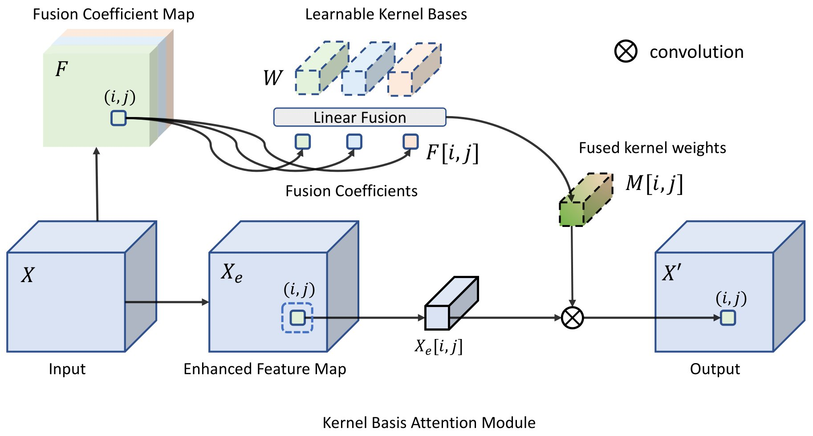

# KBNet: Kernel Basis Network for Image Restoration

[Yi Zhang](https://zhangyi-3.github.io/), 
[Dasong Li](https://dasongli1.github.io/), 
[Xiaoyu Shi](https://scholar.google.com/citations?user=fbEuTJUAAAAJ&hl=en), 
[Dailan He](https://scholar.google.com/citations?user=f5MTTy4AAAAJ&hl=zh-CN), 
[Kangning Song](), 
[Xiaogang Wang](https://scholar.google.com/citations?user=-B5JgjsAAAAJ), 
[Honwei Qin](https://scholar.google.com/citations?user=ZGM7HfgAAAAJ), 
[Hongsheng Li](https://www.ee.cuhk.edu.hk/~hsli/)

> **Abstract:** *How to aggregate spatial information plays an essential role in learning-based image restoration.
Most existing CNN-based networks adopt static convolutional kernels to encode spatial information, which cannot aggregate spatial information adaptively. 
Recent transformer-based architectures achieve adaptive spatial aggregation. But they lack desirable inductive biases of convolutions and require heavy computational costs. 
In this paper, we propose a kernel basis attention (KBA) module, which introduces learnable kernel bases to model representative image patterns for spatial information aggregation. 
Different kernel bases are trained to model different local structures. 
At each spatial location, they are linearly and adaptively fused by predicted pixel-wise coefficients to obtain aggregation weights.
Based on the KBA module, we further design a multi-axis feature fusion (MFF) block to encode and fuse channel-wise, spatial-invariant, and pixel-adaptive features for image restoration.
Our model, named kernel basis network (KBNet), achieves state-of-the-art performances on more than ten benchmarks over image denoising, deraining, and deblurring tasks while requiring less computational cost than previous SOTA methods.* 

## Network Architecture

 

## Contact
Should you have any question, please contact zhangyi@link.cuhk.edu.hk

**Acknowledgment:** [BasicSR](https://github.com/xinntao/BasicSR), [NAFNet](https://github.com/megvii-research/NAFNet), [Restormer](https://github.com/swz30/Restormer). 
 